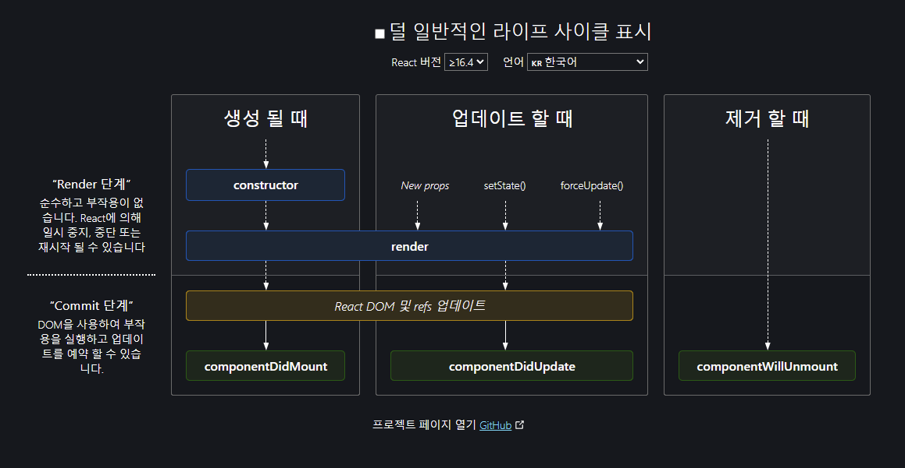

# LifeCycle

리액트 클래스 컴포넌트에서 컴포넌트가 추가, 업데이트, 삭제가 될 때
일련의 과정과 함께 동작할 수 있는 메서드들을 제공하는데 이를 LifeCycle 이라고 부르고 한글로는 생명주기 라고 합니다. 이는 여타 JS Framework에서도 인스턴스 관리를 위해 흔하게 차용이 되는 개념이라서 알아 두면 좋다.

## React Life Cycle



리액트에서 Life Cycle은 크게 Render 단계와 Commit 단계로 나눠 지는데  
Render 단계는 순수함수로 이루어져서 내부에서 외부의 값을 변경하는 일이 없어야 한다.
Commit 단계는 기타 값이 변경되는 함수들을 실행시키고 업데이트를 처리한다.

## Component 생성 단계

Component 생성시의 LifeCycle은
`Constructor -> getDerivedStateFromProps -> render -> componentDidMount` 의 순서로 이루어 진다.

### Constructor

Constructor 단계의 경우 React Component의 생성자 함수로 컴포넌트가 마운트 되기 전에 생성 단계에서 호출이 된다. Constructor 내부에서는 Super 함수를 사용해서 React.Component를 구현해야 한다.  
constructor 내부에서는 state의 기본 값을 설정할 수 있으며 이때 setState가 아닌 this.state에 초기 state값을 할당하는것만 허용이 된다. 이때 state에 props를 복사하는것도 안티패턴에 해당된다.

### componentDidMount

componentDidMount는 컴포넌트가 마운트된 직후에 실행이 된다.
DOM 노드의 초기화 작업이나 외부 데이터 요청, 이벤트 구독등을 사용하기에 좋은 위치이다.

```js
componentDidMount();
```

## Component 업데이트 단계

Component가 업데이트 될때의 LifeCycle은
`getDerivedStateFromProps -> shouldComponentUpdate -> render -> getSnapshotBeforeUpdate -> componentDidUpdate`의 순서로 이루어 진다.

### shouldComponentUpdate

shouldComponenUpdate는 현재 state와 props가 새로운 값으로 변경되었을떄 렌더링 전 단계에서 실행이 된다. 주로 변경된 state와 props를 통해 리렌더가 되지 않아도 될 상황이라면 이 메서드를 통해 건너 띌수 있다. 하지만 상태가 변경되었을때 렌더링을 최적화 하기 위해서 사용을 하기 떄문에 렌더링을 방지하는 목적으로 사용하면 안된다. 또한 render직전에 실행 되므로 비용이 오래걸리는 연산이나 많은 작업을 실행할 경우 render단계가 미뤄져서 성능이 떨어 질 수 있다.
또한 forceUpdate를 통한 강제 업데이트에서는 실행이 되지 않는다.

```js
  shouldComponentUpdate(nextProps, nextState) {}
```

### getSnapshotBeforeUpdate

getSnapshotBeforeUpdate는 업데이트 전 변경된 State와 Props가 DOM에 반영이 되기전에 실행이 된다.  
이 메서드를 사용하면 변경된 State와 Props를 활용하여 결과값을 만들어 DidUpdate에 인자로 전달할 수 있다. 주로 렌더링시 바로 변경되어야 하는 스크롤의 값 등을 처리할때 사용이 된다.

```js
  getSnapshotBeforeUpdate(prevProps, prevState) {}
```

### componentDidUpdate

componentDidUpdate는 앞의 일련의 과정을 거친다음 갱신이 일어난 직 후 호출된다.
최초 렌더링에서는 실행이 되지 않으며 업데이트 단계에서만 실행이 된다.
컴포넌트의 상태가 변경되었을때 DOM 을 조작하기위해 주로 사용을 하게 되며 내부에서 state를 변경할 경우 인자로 들어오는 prevState, props와 비교하여 예외처리를 해주어야 한다. (무한루프)

```js
  componentDidUpdate(prevProps, prevState, snapshot?) {}
```

## Commons

### getDerivedStateFromProps

컴포넌트가 최초로 마운트 될떄와 업데이트가 될때 render 메소드의 실행 직전에 호출된다.
props를 기반으로 내부 state를 변경할 수 있게 해주는 메소드이다.
처리 방법과 상관없이 무조건 렌더링 될 때 마다 실행이 되고 또 state변경을 직접 관여 하게 되면 코드가 복잡해 지므로 되도록 사용하지 않는 것이 권장된다.

```js
  static getDerivedStateFromProps(props, state) {}
```

### render

render는 클래스 컴포넌트에서 반드시 구현되어야 하는 유일한 필수 메소드 이다.
이 메소드를 통해서 컴포넌트의 내용을 렌더링을 하기 때문에 render 메소드 내부에선 반드시 React 엘리먼트나 Element 배열, Fragment, Portal, 문자열이나 숫자, Boolean, null 등의 값을 꼭 반환해야 한다.

이 render 함수는 말 그대로 render에 초점을 두었기 때문에 내부에서 값을 변경하는것을 지양하고 함수를 순수하게 렌더링용으로 유지하는것이 좋다.

```js
render();
```

### componentDidCatch

16버전에서 새롭게 도입된 cycle,
자식요소의 렌더링 도중 에러가 발생했을 경우 에러를 처리할 수 있다.
본인의 에러는 처리 할 수 없음.

```js
  componentDidCatch(error, info) {}
```
